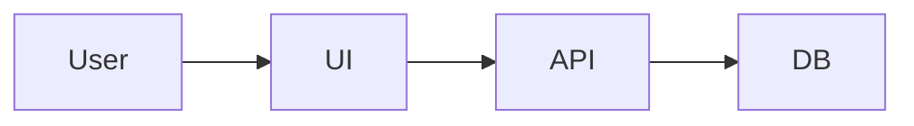

<small>Owner: TBD | Last updated: 2026-01-09 | Status: Draft</small>

# System Design (with diagrams)

> The big picture: main parts, how they talk, data flow, key assumptions, and links to important resources (Design Doc). Builds a shared mental model so teammates and reviewers can follow your design.

## Big picture
### Components
- Client/UI: TBD
- API/service(s): TBD
- Data store(s): TBD
- External dependencies: TBD

### Data flow
1. TBD
2. TBD
3. TBD

## Diagram
Use a simple diagram that communicates the main parts and how they talk.

## Key assumptions
- TBD
- TBD

## Notes for diagrams, images, and rich docs
- Prefer simple diagrams over dense architecture pictures; link to the full design doc if needed.
- If you include images, ensure they have alt text and are stable URLs.

